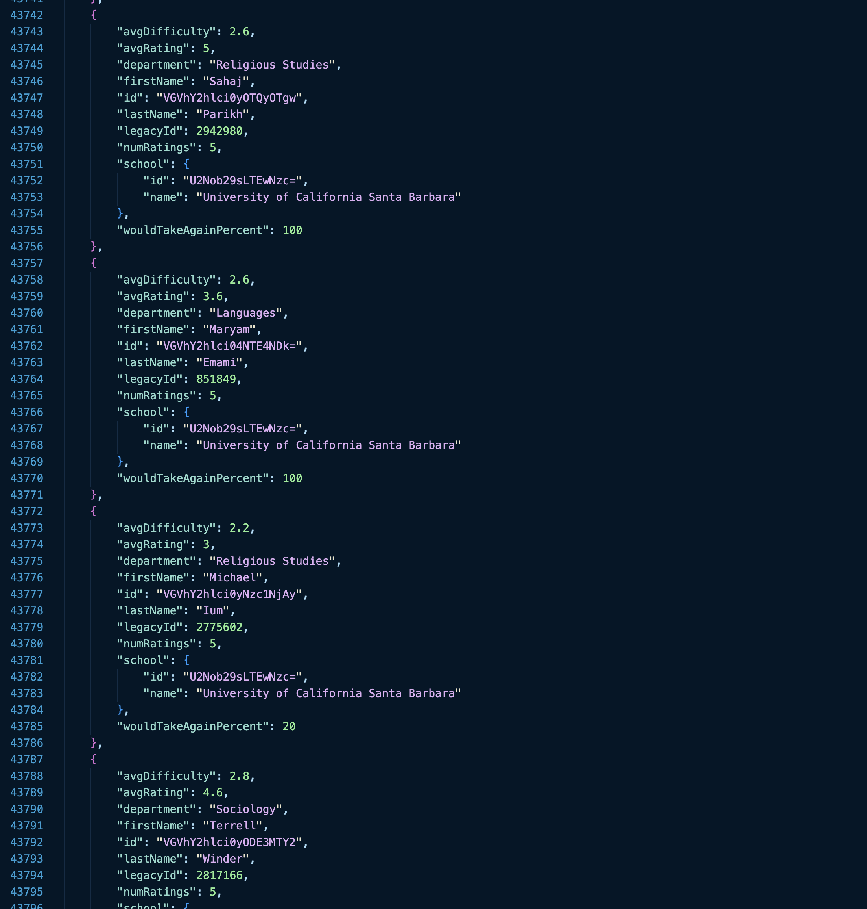
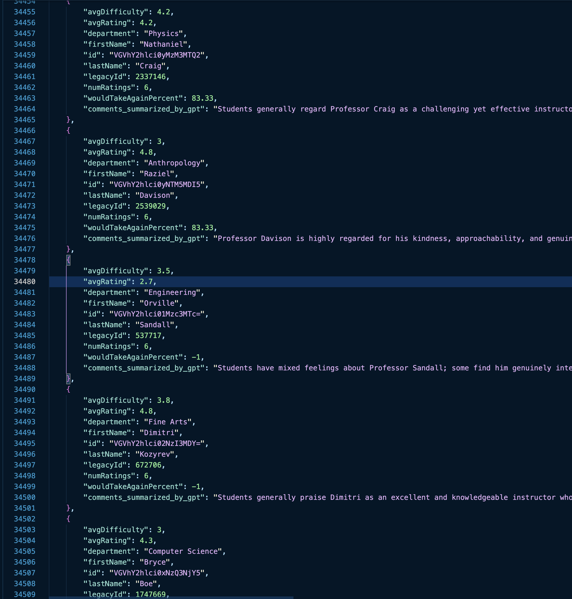

# Fetch RMP Reviews

Scrapes every UCSB professor's RateMyProfessor reviews and turns them into GPT-generated summaries — so students can pick courses without reading 200 comments per prof.

Built this as a feature for [GOLDTracker](https://github.com/AllenHsm/team04-GOLDTracker), a React Native app that helps UCSB students track class availability and register faster.

## How it works

```
┌─────────────────────┐     ┌──────────────────────┐     ┌─────────────────────┐
│  1. GraphQL Scraper │────▶│  2. Selenium Scraper │────▶│  3. GPT-4o Summary  │
│                     │     │                      │     │                     │
│  Hit RMP's GraphQL  │     │  Visit each prof's   │     │  Feed comments to   │
│  API to pull every  │     │  page, extract all   │     │  GPT-4o-mini with   │
│  UCSB professor's   │     │  student comments    │     │  temp=0 for concise │
│  name, rating,      │     │  via headless Chrome │     │  2-3 sentence       │
│  difficulty, dept   │     │                      │     │  summaries          │
└─────────────────────┘     └──────────────────────┘     └─────────────────────┘
           ▼                           ▼                            ▼
    rmp_prof.json             comments_by_prof.json      rmp_prof_with_summarized
                                                             _comments.json
```

The final JSON gets loaded into the GOLDTracker app so students see AI-generated prof evaluations right next to course listings.

## Technical decisions

### Scraping: GraphQL + Selenium hybrid

RateMyProfessor exposes a GraphQL endpoint (`/graphql`) for structured professor data — ratings, difficulty scores, departments. I use cursor-based pagination to pull every professor at UCSB in batches of 8.

But student comments aren't available through that same GraphQL query. They're dynamically rendered on each professor's page. So I spin up a headless Chrome instance with Selenium to visit each prof's page and extract the review text.

**Bot detection evasion:** RMP flags automated browsers. The scraper disables automation indicators (`excludeSwitches`, `useAutomationExtension`), spoofs the `navigator.webdriver` property, and rotates realistic user-agent strings.

### AI summarization: GPT-4o-mini at temperature 0

Full GPT-4o is overkill for summarization. GPT-4o-mini handles it fine at a fraction of the cost.

Temperature is set to 0 — I want deterministic, reproducible summaries, not creative writing. The prompt constrains output to 2-3 factual sentences that preserve student sentiment without editorializing.

```python
# The prompt is intentionally tight
system_prompt = """You are a subjective summarizer and your task is to summarize
the students' comments under a professor's Rate My Professor page. Your
summarization should be brief but accurate, without changing the students'
original message. 2-3 sentences. Nothing unrelated to the comments."""
```

Only professors with 3+ reviews get summarized — anything less isn't worth condensing.

### Rate limiting

Every stage has built-in delays:
- **GraphQL scraper:** 1s between pagination requests
- **Selenium scraper:** 2s per professor page
- **GPT API calls:** 1.5s between requests

No parallelism — staying under rate limits matters more than speed when you're scraping 800+ professors.

## Pipeline

```
RMP_scraper.py          → Pulls all UCSB prof metadata via GraphQL
scrape_comments.py      → Visits each prof's page, grabs comments
summarize_comments_by_gpt.py → Summarizes comments, merges into final JSON
Sort_profs.py           → Organizes output by department (Excel export)
```

Each stage reads the previous stage's output and writes its own JSON file. You can re-run any stage independently without re-running the full pipeline.

## Quick start

```bash
pip install selenium openai openpyxl

# 1. Scrape professor metadata
python RMP_scraper.py

# 2. Scrape student comments (takes a while — headless Chrome visits each prof page)
python scrape_comments.py

# 3. Generate AI summaries and merge
export OPENAI_API_KEY=your_key_here
python summarize_comments_by_gpt.py
```

You'll need Chrome + ChromeDriver installed for the Selenium step.

## Output format

Each professor in the final JSON looks like:

```json
{
  "legacyId": 12345,
  "firstName": "Jane",
  "lastName": "Doe",
  "department": "Computer Science",
  "avgRating": 4.2,
  "avgDifficulty": 3.1,
  "numRatings": 47,
  "wouldTakeAgainPercent": 85.0,
  "comments_summarized_by_gpt": "Students praise Prof. Doe's clear explanations and fair exams. Some note heavy workload but say it's manageable with consistent effort. Office hours are highly recommended."
}
```

### Example screenshots

After `scrape_comments.py`, comment text is stored in structured JSON (one excerpt below). The final file from `summarize_comments_by_gpt.py` adds `comments_summarized_by_gpt` alongside the same professor metadata.





## Context

This was built as part of [GOLDTracker](https://github.com/AllenHsm/team04-GOLDTracker) — a React Native app I worked on with a team of 6. The app helps UCSB students track course availability, get notifications when spots open, and register faster. I built the RMP scraping + AI summarization pipeline to add professor evaluations as a feature, giving students more signal when choosing sections.
